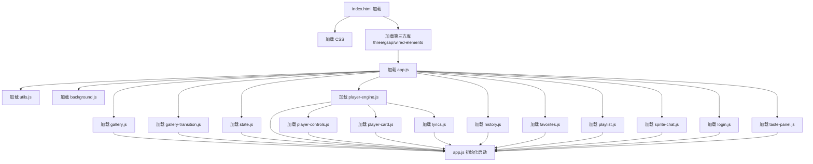

# Project Split: 单页 HTML → 模块化项目结构

## TL;DR
> **目标**: 将 460KB / 12700 行的 `nosh-music-ai.html` 按功能域拆分为独立文件，先零构建手工拆分（方案 A），再过渡到 Vite + ES Module（方案 B）。
>
> **交付物**:
> - `src/index.html` — 瘦身后的 HTML 骨架
> - `src/css/*.css` — 按功能拆分的样式文件（6-7 个）
> - `src/js/*.js` — 按功能拆分的逻辑文件（12-15 个）
> - 拆分后功能和 UI 零变化
>
> **预估工作量**: 中
> **风险**: 低（零构建，逐步替换，改一块验证一块）
> **并行度**: 中（CSS 和 JS 可以并行拆，但 JS 内部有依赖顺序）

---

## 现状分析

### 当前文件结构
```
nosh-music-ai.html (460KB, 12700行)
├── <style>                    ~3000行
├── <body> HTML                 ~400行
├── <script> 块1 (加载屏)       ~130行
├── <script> 块2 (主逻辑)       ~5260行 ← 最大
├── <script> 块3               ~400行
├── <script> 块4               ~650行
├── <script> 块5               ~940行
├── <script> 块6 (卡片动画)     ~500行
├── <script> 块7 (AlbumGallery) ~1110行
└── <script> 块8 (导航逻辑)     ~450行

已外置的 JS: audio-analyzer.js, particle-system.js,
             nosh-persist.js, nosh-taste.js
第三方库: lib/ [three.min.js, gsap.min.js, wired-elements*.js]
已有构建工具: vite, esbuild (devDependencies)
```

### 痛点
1. **单文件 460KB** — 任何修改都要在大文件里定位，编辑体验差
2. **所有功能耦合** — 播放器、画廊、聊天、登录全在一个作用域
3. **全局命名空间污染** — `window.xxx` 遍地，无法 tree-shaking
4. **CSS 3000 行无拆分** — 改样式要搜半天的 CSS 选择器
5. **无法团队协作** — 一个人改一个文件，冲突概率 100%

---

## 方案 A：零构建 · 手工拆分（Phase 1）

### 目标结构

```
noshRadio/
├── src/
│   ├── index.html              ← 仅 HTML 结构 + <link>/<script> 引用
│   │
│   ├── css/
│   │   ├── base.css            (reset, CSS变量, body, topbar, 背景)
│   │   ├── loading.css          (加载屏)
│   │   ├── player.css           (player-card, 封面, 控制栏, 进度条, track-info)
│   │   ├── gallery.css          (#albumGallery3D, curtain, transitionWave, drift info)
│   │   ├── sprite-chat.css      (sprite-drawer, 聊天面板, 歌单, 标签栏, 输入区)
│   │   ├── modal.css            (登录/品味/专辑歌曲/onboarding/NOSH Profile)
│   │   └── responsive.css       (@media 查询)
│   │
│   ├── js/
│   │   ├── app.js               ← 入口：加载屏管理、初始化调度
│   │   ├── state.js             ← 全局状态对象 (currentView,播放历史,收藏…)
│   │   ├── player-engine.js     ← audio 元素管理 (play/stop/seek/volume)
│   │   ├── player-controls.js   ← UI: 播放/暂停/上一首/下一首/进度条/音量
│   │   ├── player-card.js       ← UI: 封面显示/折叠展开动画/音浪动画
│   │   ├── lyrics.js            ← 歌词加载/同步/覆盖层/移出模式
│   │   ├── playlist.js          ← 歌单管理 (CRUD/拖拽/播放)
│   │   ├── history.js           ← 播放历史 (记录/展示/排序)
│   │   ├── favorites.js         ← 收藏管理
│   │   ├── gallery.js           ← AlbumGallery (Three.js 类)
│   │   ├── gallery-transition.js ← 幕布开合 + 过渡音浪
│   │   ├── sprite-chat.js       ← AI 聊天面板 (消息/PTT/推荐)
│   │   ├── login.js             ← 登录弹窗 (手机/邮箱/扫码)
│   │   ├── taste-panel.js       ← 品味设置面板
│   │   ├── background.js        ← ASCII 律动波点 + WebGL 蓝雾
│   │   └── utils.js             ← 工具函数 (时间格式化/防抖/随机数)
│   │
│   └── lib/                     ← 第三方库 (不变)
│
├── main.js                       ← Electron 主进程 (不变)
├── preload.js                    ← preload (不变)
├── proxy-server.js               ← Express 代理 (不变)
├── nosh-persist.js               ← 已外置 (不变)
├── nosh-taste.js                 ← 已外置 (不变)
└── vite.config.js                ← (Phase 2 时改造)
```

### 生命周期函数依赖图



> 注意：由于方案 A 使用全局 `<script>`（非 module），加载顺序由 `<script>` 标签的顺序决定。上述顺序即推荐引用顺序。

### CSS 拆分边界

| 当前行号 | 内容 | 目标文件 |
|---------|------|---------|
| 76-163 | :root 变量、主题 | `base.css` |
| 165-176 | body::before 质感背景 | `base.css` |
| 178-185 | ascii-canvas | `base.css` |
| 187-261 | loading-screen | `loading.css` |
| 263-340 | hero-bg, 标题律动 | `base.css` |
| 342-463 | topbar, win-controls, theme-toggle | `base.css` |
| 502-520 | bg-toggle | `base.css` |
| 522-547 | .content, .player-section | `player.css` |
| 549-565 | .player-card | `player.css` |
| 567-643 | player-addplaylist-btn, player-like-btn | `player.css` |
| 644-761 | album-wrap, lyrics-overlay | `player.css` + `lyrics.css` |
| 762-824 | lyrics-below-card | `lyrics.css` |
| 826-950 | album-frame, neon-disc, album-pixel-art | `player.css` |
| 950-982 | track-info | `player.css` |
| 984-1031 | progress-wrap | `player.css` |
| 1033-1070 | controls | `player.css` |
| 1072-1118 | bottom-bar, volume, loop | `player.css` |
| 1120-1291 | history-box | 保留在 `player.css`（或独立） |
| 1293-1313 | genre-section | `taste-panel.css` |
| 1318 | footer | `base.css` |
| 1320-1390 | bottom-nav | `gallery.css` |
| 1392-1508 | album-drift 相关 | `gallery.css` |
| 1510-1526 | #albumGallery3D | `gallery.css` |
| 1528-1672 | sprite-drawer, sprite-panel | `sprite-chat.css` |
| 1669-1732 | tab-bar, tab-content | `sprite-chat.css` |
| 1734-1802 | sprite-playlist | `sprite-chat.css` |
| 1818-1932 | sprite-messages | `sprite-chat.css` |
| 1934-1983 | tag-pills | `sprite-chat.css` |
| 1985-2072 | sprite-input, PTT, mic | `sprite-chat.css` |
| 2077-2103 | tweaks | `modal.css` |
| 2105-2146 | login-modal | `modal.css` |
| 2148-2166 | onboarding | `modal.css` |
| 2168-2503 | taste-panel, nosh-profile | `modal.css` |
| 2505-2559 | login-status, qr | `modal.css` |
| 2561-2605 | sound-toggle, msg-actions | `sprite-chat.css` |
| 2607-2856 | wired-elements overrides | 分散到各 CSS 文件 |
| 2878-3022 | @media responsive | `responsive.css` |

### JS 拆分边界

| 块 | 当前行号 | 功能 | 目标文件 | 预估行数 |
|---|---------|------|---------|---------|
| 块1 | ~3499-3628 | 加载屏进度/隐藏 | `app.js` | ~130 |
| 块2 | ~3629-8895 | 主应用逻辑 | 多个 | ~5260 |
| 块2子集 | — | DOM引用/全局变量 | `state.js` | ~80 |
| 块2子集 | — | audio 引擎 | `player-engine.js` | ~300 |
| 块2子集 | — | 播放控制UI | `player-controls.js` | ~400 |
| 块2子集 | — | 歌词 | `lyrics.js` | ~350 |
| 块2子集 | — | 歌单 | `playlist.js` | ~500 |
| 块2子集 | — | 历史记录 | `history.js` | ~200 |
| 块2子集 | — | 收藏 | `favorites.js` | ~100 |
| 块2子集 | — | AI聊天 | `sprite-chat.js` | ~800 |
| 块2子集 | — | 登录 | `login.js` | ~500 |
| 块2子集 | — | background | `background.js` | ~300 |
| 块2子集 | — | taste-panel | `taste-panel.js` | ~400 |
| 块2子集 | — | 工具函数 | `utils.js` | ~100 |
| 块3 | ~8897-9095 | 品味相关 | `taste-panel.js` | ~200 |
| 块4 | ~9097-9741 | ASCII + WebGL | `background.js` | ~650 |
| 块5 | ~9743-10681 | 背景相关 | `background.js` | ~940 |
| 块6 | ~10683-11221 | 卡片折叠/展开/音浪 | `player-card.js` | ~540 |
| 块7 | ~11224-12337 | AlbumGallery | `gallery.js` | ~1110 |
| 块8 | ~12340-12786 | 导航/过渡/入口动画 | `gallery-transition.js` | ~450 |

---

## 方案 B：Vite + ES Module（Phase 2）

### 目标

在方案 A 的基础上，将 `src/js/*.js` 升级为 ES Module：

```js
// 改造前
function playNext() { ... }
window.playNext = playNext;

// 改造后
export function playNext() { ... }
import { playNext } from './player-controls.js';
```

### 构建流水线

```
Vite Dev Server (port 5173)
  ├─ 反向代理 /api/* → proxy-server (8081)
  ├─ serve src/index.html
  └─ HMR 热更新

Electron main.js
  ├─ 开发: loadURL('http://localhost:5173/')
  └─ 生产: loadURL('http://localhost:8081/') (serve dist/)
```

### vite.config.js 改造目标

```js
export default defineConfig({
  root: 'src',
  base: './',
  build: {
    outDir: '../dist',
    emptyOutDir: true,
  },
  server: {
    proxy: {
      '/api': 'http://localhost:8081'
    }
  }
})
```

### 过渡策略

1. 先方案 A 全部分拆为独立文件（全局变量模式）
2. 在 ES Module 边界处加 `export`，在入口用 `import`
3. 逐个模块从 `window.xxx` 改为 `import { xxx }`
4. 全部完成后删除 `window.xxx` 赋值
5. 替换 `index.html` 中所有 `<script src>` 为 `<script type="module" src="...">`

---

## 方案 C：框架迁移（不推荐现在做）

将 JS 换为 Vue / Svelte / React 组件化架构。风险极高，收益不确定，建议在方案 B 稳定后再评估。

---

## 执行计划

### Phase 1A: CSS 拆分（1 次，低风险）

1. 创建 `src/css/` 目录
2. 按上表逐个抽取 CSS 块到对应文件
3. `index.html` 中将 `<style>` 替换为 `<link>` 引用
4. 验证：打开界面检查所有样式正常

### Phase 1B: JS 拆分（分 3 波并行）

**Wave 1**（无损切分，零逻辑改动）：
- `state.js` — 抽取全局变量
- `utils.js` — 抽取工具函数
- `favorites.js` — 抽取收藏逻辑
- `player-engine.js` — 抽取 audio 引擎

**Wave 2**（UI 逻辑切分）：
- `player-controls.js`
- `lyrics.js`
- `history.js`
- `playlist.js`
- `login.js`

**Wave 3**（大模块切分）：
- `sprite-chat.js`（~800 行）
- `background.js`（~1600 行，合并块4+块5）
- `gallery.js`（~1110 行）
- `gallery-transition.js`（~450 行）
- `player-card.js`（~540 行）
- `app.js`（入口调度）

### Phase 2: Vite + ES Module（方案 B 落地）

在 Phase 1 全部完成后，逐模块改为 `import/export`。

---

## 验证清单

每个拆分步骤完成后检查：
- [ ] 播放/暂停/上一首/下一首正常
- [ ] 进度条拖动正常
- [ ] 歌词显示同步
- [ ] 陈列室（画廊）点击/滚轮交互正常
- [ ] 幕布开合过渡动画正常
- [ ] 聊天面板展开/消息发送正常
- [ ] 历史记录和收藏显示正常
- [ ] 登录弹窗正常
- [ ] 主题切换正常
- [ ] 响应式布局正常
